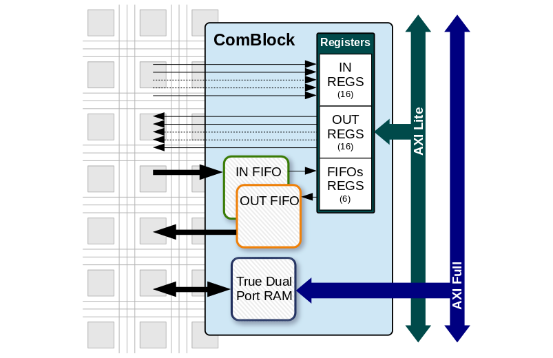

The Communication Block IP Core (Core ComBlock) is the result of a collaboration between the [Multidisciplinary LABoratory](https://www.ictp.it/research/ap/research/mlab.aspx) (MLAB) from The Abdus Salam [International Centre for Theoretical Physics](https://www.ictp.it/) (ICTP, Italy) and the FPGA division of [Micro and Nanotechnology](https://www.inti.gob.ar/areas/desarrollo-tecnologico-e-innovacion/areas-de-conocimiento/micro-y-nanotecnologias) from the [National Institute of Industrial Technology](http://www.inti.gob.ar/) (INTI, Argentina). It is licensed under the BSD 3-clause.

> You can find the User Guide and tutorials [here](doc/README.md).

MLAB projects are characterized by solving the high-speed acquisitions and processing in the FPGA and send the resulting data to a PC. The Processor included in devices such as Zynq is mainly considered as a provider of data storage (DDR memory) and Ethernet connections. The ComBlock was created to provide known interfaces (registers, RAM and FIFOs) to a user of the Programmable Logic (PL), avoiding the complexity of the bus provided by the Processor System (PS), which is AXI in case of the Zynq-7000.

A first version was made in Vivado using IPs from Xilinx. To obtain a portable and highly configurable IP, a second version was developed, using VHDL 93 and memories of the [FPGA Lib](https://github.com/INTI-CMNB-FPGA/fpga_lib) project (an asynchronous FIFO and a True Dual Port RAM, both of them tested with Xilinx, Intel/Altera and Microchip/Microsemi devices). The block provides:

* Up to 16 input and/or output registers (configurable from 1 to 32 bits).
* A True Dual-Port RAM, which provides a Simple RAM interface available to the user. Its inclusion, the data width, the address width and the memory depth can be configured.
* Two asynchronous FIFOs, one from PL to PS and another from PS to PL, with indications of empty/full, almost empty/full and underflow/overflow conditions. Their individual inclusion, the data width and the memory depth can be configured.

In the Vivado IP Package version, an AXI Lite interface was used for the registers and the FIFOs, while an AXI Full interface was used for the RAM.

# License

The sources of the ComBlock, their examples and testbenches, are licensed under the [BSD 3-clause](LICENSE).

The documentation of the project is distributed under a
[Creative Commons Attribution 4.0 International License](https://creativecommons.org/licenses/by/4.0/).
