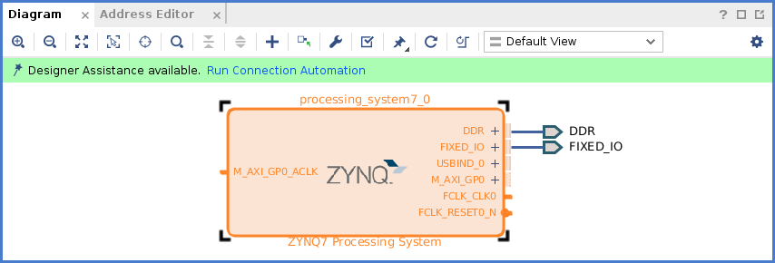
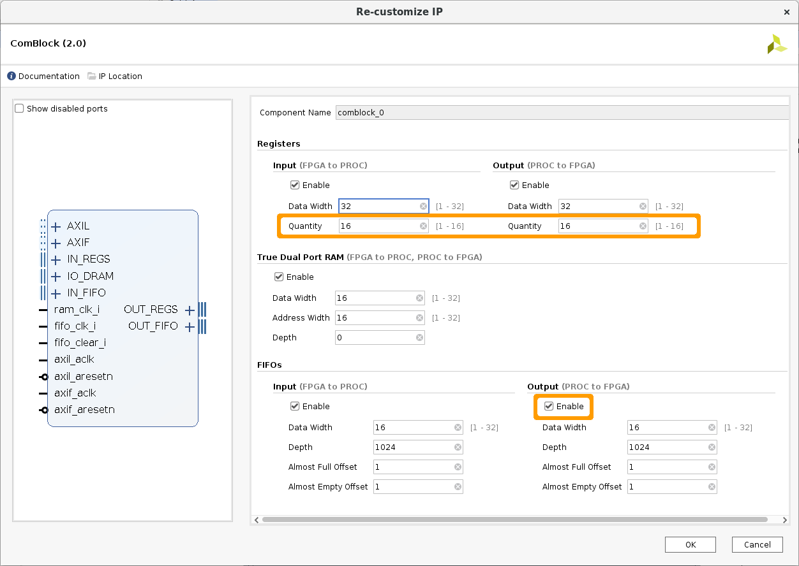
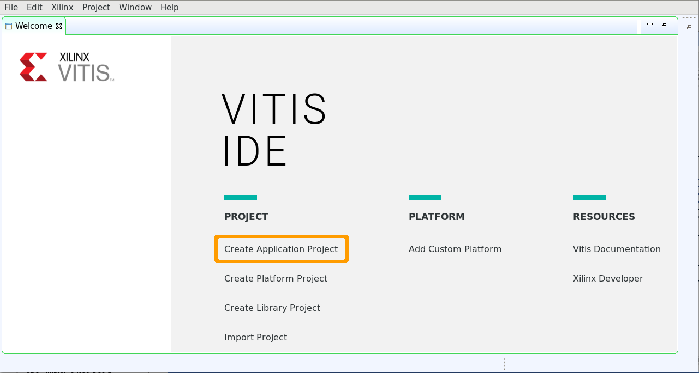

# Tutorial: ComBlock in Vivado

Previous to the version 2019.2, it was enough to download Vivado to have also the Software
Development Kit (SDK).
From version 2019.2, you must download Vitis, which also installs Vivado.

The tutorial is organized as follows:
* [Vivado](#vivado)
* [Vitis (Vivado 2019.2 and later)](#vitis-vivado-20192-and-later)
* [SDK (Vivado 2019.1 and earlier)](#sdk-vivado-20191-and-earlier)

# Vivado

## Step 1 - Create a new project

Open Vivado and select *Create Project* to launch the *New Project* wizard.

Select *Project name* and *Project location*, then **Next**.

Select *RTL Project* and check *Do not specify sources at this time*.
Press **Next**.

In the *Default Part* screen, select the *Boards* tab, choose the *ZedBoard*
and press **Next**.

Press **Finish** in the *New Project Summary* screen.

## Step 2 - Include the ComBlock

To add the *ComBlock* to the *IP Repository*, go to *Settings* -> *IP* -> *Repository*.
Click on `+` and browse to `core_comblock/src`.
Pree *Select*.

One IP (the *ComBlock*) and five interfaces must be found.
Press **Ok** to confirm.

Click on *Create Block Design* and accept the default *Design name* pressing **Ok**.

Press `+` to search the *ComBlock* (you can use the *search* file to filter results).

Select the *ComBlock* and it will appear as a component in the *Diagram* tab.

## Step 3 - Include the PS

Here we will add the *Processor System*.
Press `+` and search *zynq* to include *ZYNQ7 Processing System*.

A green line (*Designer Assistance*) will appear. Select *Run Block Automation*.

Be sure to check *Apply Board Preset*.

Press **Ok**. You will see that *Run Block Automation* disappeared.

Double click in the Zynq Component to *Re-customize IP*.
Go to *Peripheral I/O Pins* and uncheck *TTC0*.

Then press **Ok**.

Select *Run Connection Automation*, then press **Ok**.

You will have a *block design* as follows:

## Step 4 - Final design

Go to *Add Sources* and select *Add or create design sources*.

Press `+` or *Add Files*.

Browse to `core_comblock/src/helpers` and select `fifo_loop.vhdl`.

Press **Finish**.

Go to the *Sources* panel -> *Design Sources*, right-click over `fifo_loop.vhdl`
and select *Add Module to Block Design*.

You will have a *block design* as follows:

## Step 5 - ComBlock connections

Double click over the *ComBlock* component.
Select 16 input and output registers.
Enable the FIFO output.

Connect *reg0_o* to *reg15_i*, *reg1_o* to *reg14_i* and so on.

Interconnect the `fifo_loop` with the *ComBlock as follows:

You will have a *block design* as follows:

Optionally, you can select the *Processing System*, the *PS Reset* and
the *AXI SmartConnect*, right-click and create a *Hierarchy*, to have
a simpler *block design*, as follows:

## Step 6 - Generate the Bitstream

Run *Validate Design*.

Go to *Sources* panel, rigth-click over the *block design* name and select
*Create HDL Wrapper*.
Choose *Let Vivado manage wrapper and auto-update* and press **Ok**.

Go to *Flow Navigator* -> *Program and Debug* and select *Generate Bitstream*,
then press **Ok**.

When *Bitstream Generation Completed* appeared, press *Cancel*.

From here, you need to choose how to follows according to the suite version.

* [Vitis (Vivado 2019.2 and later)](#vitis-vivado-20192-and-later)
* [SDK (Vivado 2019.1 and earlier)](#sdk-vivado-20191-and-earlier)

# Vitis (Vivado 2019.2 and later)

Go to *File* -> *Export* -> *Export Hardware*, check *Include bitstream* and press **Ok**.

*Export Hardware for Vitis (2019.2 and later)*

To launch Vitis from Vivado, go to *Tools* -> *Launch Vitis*.

## Step 7 - Launching Vitis

After the *Splash Screen*, you must select a workspace.

Select one and press *Launch* to reach the *Welcome Screen*.

Select *Create Application Project*.

## Step 8 - Project Creation

Choose a *Project name* and press **Next**.

Go to the Tab *Create a new platform from hardware (xsa)* and press the `+` button.

Browse to your project directory and select the previously exported XSA.
Press the **OK** button and then **Next**.

Select *OS* and *Language* (the default options, *standalone* and *C*, for this example).
Press **Next**.

Select a *Template* (*Hello World* for this example) and press **Finish**.

You will reach the Vitis Project Screen.

## Step 9 - Working with Vitis

Go to *Xilinx* -> *Program FPGA* and transfer the selected bitstream.

Select the System Project (*tutorial_example* in our case), right-click and select
*Build Project* to launch the compilation.

Go to *Open Console* -> *Command Sheel Console* and configure the Serial Terminal
(or use your favourite terminal).

Select the System Project, *right-click* and select *Run As* -> *1 Launch on Hardware*.

Go to *Display Selected Console* and select your previously configured terminal
(or check your terminal output).

From here, you can change `helloworld.c` (*tutorial_system* -> *tutorial* -> *src*) (for example
with code from [this](../examples/test/test.c) example), Build the Project and Run again.

# SDK (Vivado 2019.1 and earlier)

Go to *File* -> *Export* -> *Export Hardware*, check *Include bitstream* and press **Ok**.

*Export Hardware for SDK (2019.1 and earlier)*

To launch SDK from Vivado, go to *File* -> *Launch SDK*.

## Step 7 - Launching SDK

After the *Splash Screen*, you will reach the following screen.

Go to *File* -> *New* -> *Application Project*.

## Step 8 - Project Creation

Choose a *Project name*.
Select *OS* and *Language* (the default options, *standalone* and *C*, for this example).
Press **Next**.

Select a *Template* (*Hello World* for this example) and press **Finish**.

## Step 9 - Working with SDK

Go to *Xilinx* -> *Program FPGA* and transfer the selected bitstream.

Go to *SDK Terminal* -> `+` and configure the Serial Terminal
(or use your favourite terminal).

Select the Appliation Project (*tutorial* in our case), right-click and
select *Run As* -> *1 Launch on Hardware*.

Go to *SDK Terminal* (or check your terminal output) and see the result.

From here, you can change `helloworld.c` (*tutorial* -> *src*) (for example with code
from [this](../examples/test/test.c) example), and Run again.
