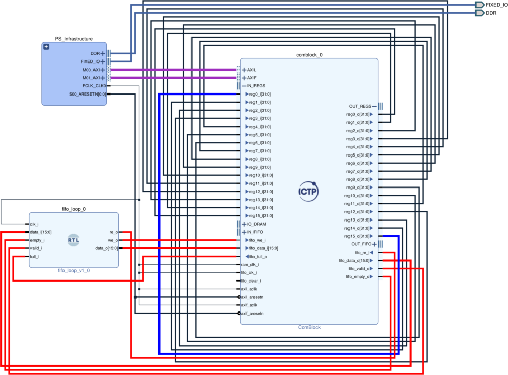

# Test example

The *PS_infrastructure* hierarchy includes the PS, a System Reset and an AXI Interconnect.

The block *fifo_loop* is a very simple VHDL which was included with the option *Add module to Block Design*.

Highlighted interconnection:
* AXI interfaces (purple)
* Cross between reg0_i and reg15_o (blue)
* FIFO loopback (red)

## General instructions for Zynq devices using Vivado

* Create a project for the desired board
* Add `../../src` to the project (Settings -> IP -> Repository)
* Add the Source `../../src/helpers/fifo_loop.vhdl`
* Run in the *Tcl console* the command `source <BOARD>.tcl`
* Create a wrapper for the design
* The wrapper must be the top level (if not, right click -> `Set as Top`)
* Generate the Bitstream
* Export Hardware (include the Bitstream)

* Launch Vitis (2019.2 and later) or SDK (2019.1 and before)
* Create an Empty Baremetal/Standalone Application
* Imports under `src` the file `test.c`
* Program the FPGA, configure a serial terminal and run the Application
