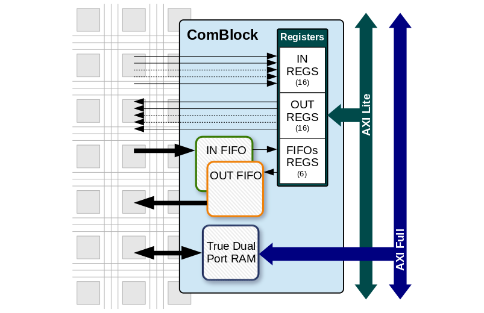
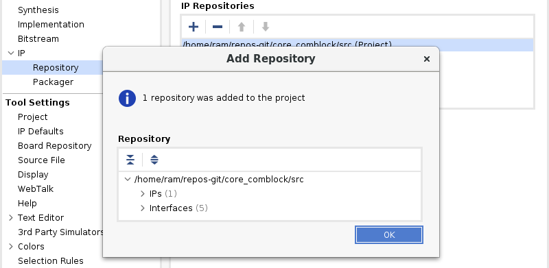
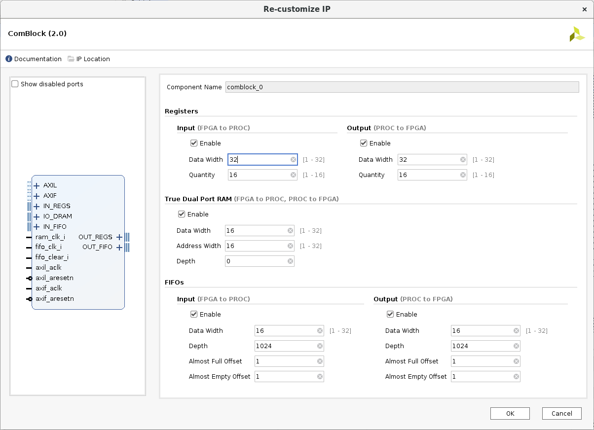
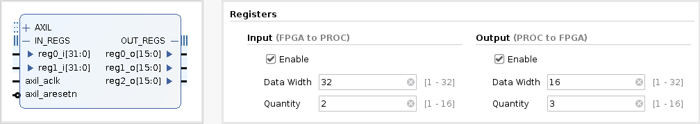
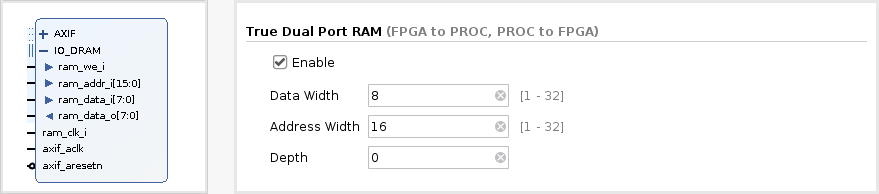
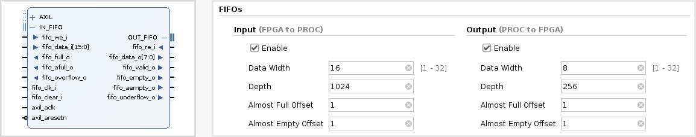
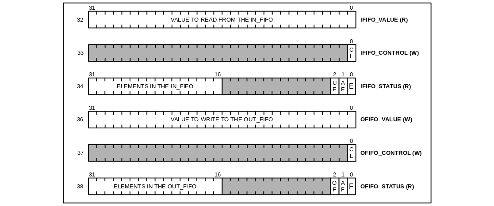

# The ComBlock User Guide

rev 2.1 - December, 2019


# Table of Contents

* [Introduction](#introduction)
* [Features](#features)
* [Resources](#resources)
* [FPGA Side](#fpga-side)
    * [How to use](#how-to-use)
    * [Configurations](#configurations)
    * [Registers](#registers)
    * [True Dual Port RAM](#true-dual-port-ram)
    * [FIFOs](#fifos)
* [Processor Side](#processor-side)
    * [Registers Map](#registers-map)
    * [C driver](#c-driver)
        * [Defines](#defines)
        * [Functions](#functions)
        * [Getting Configurations](#getting-configurations)
    * [Examples](#examples)
* [Appendix A: ComBlock codebase](#appendix-a-comblock-codebase)
* [Appendix B: Revisions History](#appendix-b-revisions-history)

# Introduction



The COMmunication BLOCK (ComBlock) was created to provide known interfaces (registers, RAM and FIFOs) to a user of the Programmable Logic (PL), avoiding the complexity of the bus provided by the Processor System (PS), which is AXI in case of the Vivado version.


It provides 5 interfaces for the user in the FPGA side:

* `IN_REGS`:  input registers.
* `OUT_REGS`: output registers.
* `IO_DRAM`:  input/output True Dual Port RAM.
* `IN_FIFO`:  input FIFO.
* `OUT_FIFO`: output FIFO.

In case of the Vivado version, it provides 2 interfaces for control in the Processor side:

* `AXIL`: AXI4 Lite with the registers and FIFOs.
* `AXIF`: AXI4 Full with the RAM.

# Features

* Designed with the goal of being easy to use and portable.
* Highly configurable: 5 interfaces, which could be individually enabled, with their own parameters.
* 0 to 16 input and output registers (configurable up to 32 bits).
* A True Dual-Port RAM, which provides a Simple RAM interface available to the user. Its inclusion, the data width, the address width and the memory depth can be configured.
* Two asynchronous FIFOs, one from PL to PS and another from PS to PL, with flags of empty/full, almost empty/full and underflow/overflow conditions. Their individual inclusion, the data width and the memory depth can be configured, as well as the difference to indicate almost Empty/Full.
* Packaged for Vivado with AXI interfaces.
* A C-Driver for the Processor side is provided.

# Resources

Following you will find the resources utilization of different configurations of the ComBlock, using Vivado `2019.1` with the ZedBoard as target.

Config | LogicLUTs | FFs | RAMB36 | RAMB18
---    | :-:       |:---:|:---:   |:---:
full   | 664       | 782 | 32     | 2
fifos  | 217       | 187 | 0      | 2
dram   | 144       | 74  | 32     | 0
regs16 | 305       | 564 | 0      | 0
regs4  | 107       | 178 | 0      | 0

Where:

* **full:**
    * Input and Output Registers are enabled, both of them configured as 16 registers of 32 bits.
    * DRAM is enabled, with 16 bits for address and data width.
    * Input and Output FIFOs are enable, both of them configured with 16 bits for data width and a depth of 1024 values.
* **fifos:**
    * Input and Output FIFOs are enabled, both of them configured with 16 bits for data width and a depth of 1024 values.
* **dram:**
    * DRAM is enabled, with 16 bits for address and data width.
* **regs16:**
    * Input and Output Registers are enabled, both of them configured as 16 registers of 32 bits.
* **regs4:**
    * Input and Output Registers are enabled, both of them configured as 4 registers of 32 bits.

# FPGA Side

## How to use

To be available as a component in a Vivado *block design*:

* Select `Project Settings` under `Flow Navigator`
* Go to `IP` -> `Repository`
* Press the `Add Repository` button (`+`)
* Browse to `<COMBLOCK_ROOT>/src`



> Note: the five interfaces in the image are internally used by the core.

## Configurations

Each of the 5 user interfaces can be enabled individually, which determines the editable configurations.
The configurations, including enable, are passed as *Generics/Parameters* to the underlying IP core.

The AXIL interface is available if at least one register or FIFO interface is used, while the AXIF interface is only available when the RAM interface is used.
Both are automatically connected to an AXI interconnect when *Run connection Automation* is used.



> The output register interface is automatically enabled when all the other interfaces are disabled, to avoid an empty component

## Registers



Signal | Range     | Dir | Description
---    |:---:      |:---:| ---
regN_i | WIDTH-1:0 | I   | Input Register 0..15
regN_o | WIDTH-1:0 | O   | Output Register 0..15

* Input registers are Read from 0 to 15 (if available according to the selected Quantity).
* Output registers can be Written/Read from 16 to 31.

## True Dual Port RAM



Signal     | Range      | Dir | Description
---        |:---:       |:---:| ---
ram_clk_i  |            | I   | Clock
ram_we_i   |            | I   | Write Enable
ram_addr_i | AWIDTH-1:0 | I   | Address
ram_data_i | DWIDTH-1:0 | I   | Data Input
ram_data_o | DWIDTH-1:0 | O   | Data Output

* The True Dual Port RAM Interface is considered as I/O (bidirectional).
* If DEPTH is 0, the quantity of memory positions is calculated as 2**AWIDTH.
* A DEPTH greater than 0 is useful when the complete address space produce a waste of resources (as example, in the Xilinx 7-series, the BRAM are used as 18/36 Kb, which are not a power of 2).
* Due to its nature, is a good interface to perform a Clock Domain Crossing (CDC).

## FIFOs



Signal           | Range       | Dir | Description
---              |:---:        |:---:| ---
fifo_clk_i       |             | I   | Shared Clock
fifo_clear_i     |             | I   | Shared Clear
fifo_we_i        |             | I   | IN_FIFO Write enable
fifo_data_i      | DWIDTH-1:0  | I   | IN_FIFO Data Input
fifo_full_o      |             | O   | IN_FIFO Full flag
fifo_afull_o     |             | O   | IN_FIFO Almost Full flag
fifo_overflow_o  |             | O   | IN_FIFO Overflow flag
fifo_re_i        |             | I   | OUT_FIFO Read enable
fifo_data_o      | DWIDTH-1:0  | O   | OUT_FIFO Data Output
fifo_valid_o     |             | O   | OUT_FIFO Data Valid flag
fifo_empty_o     |             | O   | OUT_FIFO Empty flag
fifo_aempty_o    |             | O   | OUT_FIFO Almost empty flag
fifo_underflow_o |             | O   | OUT_FIFO Underflow flag

* Both FIFOs are asynchronous, so they could be also used to perform a CDC.
* The Clear input is used to have a know state in both sides of the FIFOs.
* DEPTH has the same sense that in the DRAM_IO interface.
* AEMPTY/AFULL means *Almost*.
* Overflow/Underflow conditions must be avoided reading Full/Empty flags to ensure not to lose data.

# Processor Side

## Registers Map

* `IN_REGS` are available from 0 to 15 (`IREG0` to `IREG15`, only read).
* `OUT_REGS` are available from 16 to 31 (`OREG0` to `OREG15`, write and read).
* `IN_FIFO` registers for value, control and status are available from 32 to 34.
* `OUT_FIFO` registers for value, control and status are available from 36 to 38.

More details about the FIFOs registers are available following:



Where:

* `CL`: clear
* `E`:  empty
* `AE`: almost empty
* `UF`: there were one or more underflows (cleared when read)
* `F`:  full
* `AF`: almost full
* `OF`: there were one or more overflows (cleared when read)

> *Elements in the FIFO* indication are only available to the processor side, and are the difference between the internal `write` and `read` pointers.

## C Driver

A C driver to be used with a Baremetal or FReeRTos project is provided. It can be included as:
```
#include "comblock.h"
```

### Defines

The registers can be accessed by number or with the following provided names (*defines*):

Number | Name               | Description
:---:  | ---                | ---
0:15   | CB_IREGn           | Input Register 0..15
16:31  | CB_OREGn           | Output Register 16..31
32     | CB_IFIFO_VALUE     | IN_FIFO value
33     | CB_IFIFO_CONTROL   | IN_FIFO control
34     | CB_IFIFO_STATUS    | IN_FIFO status
36     | CB_OFIFO_VALUE     | OUT_FIFO value
37     | CB_OFIFO_CONTROL   | OUT_FIFO control
38     | CB_OFIFO_STATUS    | OUT_FIFO status

> `CB_` is the prefix of the ComBlock defines.

### Functions

To write/read one memory position:

* `void cbWrite(UINTPTR baseaddr, u32 reg, u32 value)`
* `u32 cbRead(UINTPTR baseaddr, u32 reg)`

To write/read several contiguous memory positions:

* `void cbWriteBulk(UINTPTR baseaddr, int *buffer, u32 depth)`
* `void cbReadBulk(int *buffer, UINTPTR baseaddr, u32 depth)`

> `cb` is the prefix of the ComBlock functions.

Where:

* `baseaddr`: is the base address of the bus.
* `reg`: is the number of register or memory offset.
* `value`: is the value to store.
* `u32`: is the returned value.
* `buffer`: is where to take (`write`) or put (`read`) data.
* `depth`: is the quantity of elements in case of `bulk` operations.

### Getting Configurations

* Vivado provides a file called `xparameters.h` in their *Software Development Kit* (SDK), where the base addresses of the buses are defined.
Additionally, in case of the ComBlock, you can find also defines related to the *[configurations](#configurations)* values selected in the programmable side.

## Examples

* Write an specific Output Register:
```
cbWrite(AXIL_BASEADDR, CB_OREG0, 0x99);
```
* Write 16 Output Registers (option 1):
```
for (i=0; i < 16; i++)
    cbWrite(AXIL_BASEADDR, CB_OREG0 + i, 0x22);
```
* Write 16 Output Registers (option 2):
```
cbWriteBulk(AXIL_BASEADDR, wr_buffer, 16);
```
* Read an specific Input Register:
```
data = cbRead(AXIL_BASEADDR, CB_IREG4);
```
* Write 1024 DRAM memory positions:
```
cbWriteBulk(AXIF_BASEADDR, wr_buffer, 1024);
```
* Read 90 DRAM memory positions:
```
cbReadBulk(rd_buffer, AXIF_BASEADDR, 90);
```
* Write 100 values to the Output FIFO:
```
for (i=0; i < 100; i++)
    cbWrite(AXIL_BASEADDR,CB_OFIFO_VALUE,i);
```
* Read 50 values from the Input FIFO:
```
for (i=0; i < 50; i++) {
    data[i] = cbRead(AXIL_BASEADDR, CB_IFIFO_VALUE);
```

# Appendix A: ComBlock codebase

The HDL codebase of the ComBlock is under `src/comblock/hdl`.

The main functionality is solved with:

* `tdpram.vhdl`: a True Dual Port RAM.
* `graysync.vhdl`: a Gray Code synchronizer.
* `fifo.vhdl`: which internally uses `tdpram` and `graysync`.
* `comblock.vhdl`: the top level which joins all together.

> Under the hood, it was descripted using VHDL'93 and inferred memories of the [FPGA Lib](https://github.com/INTI-CMNB-FPGA/fpga_lib) project, which were tested with Xilinx, Intel/Altera and Microchip/Microsemi devices.

The signals provided to the FPGA side are depicted in [Registers](#registers), [True Dual Port RAM](#true-dual-port-ram) and [FIFOs](#fifos).
Two additional interfaces are available to be connected with a system bus.

Signal        | Range | Dir | Description
---           |:---:  |:---:| ---
reg_clk_i     |       | I   | Shared Clock
reg_wr_ena_i  |       | I   | Write Enable
reg_wr_data_i | 31:0  | I   | Write Data Input
reg_wr_addr_i | 5:0   | I   | Write Address
reg_rd_ena_i  |       | I   | Read Enable
reg_rd_data_o | 31:0  | O   | Read Data Output
reg_rd_addr_i | 5:0   | I   | read Address

Signal     | Range              | Dir | Description
---        |:---:               |:---:| ---
mem_clk_i  |                    | I   | Clock
mem_we_i   |                    | I   | Write Enable
mem_addr_i | DRAM_IO_AWIDTH-1:0 | I   | Address
mem_data_i | DRAM_IO_DWIDTH-1:0 | I   | Data Input
mem_data_o | DRAM_IO_DWIDTH-1:0 | O   | Data Output

The `axi_comblock.vhdl` file with `axil.vhdl` and `axif.vhdl` solves the AXI version.

> If a tool has not a supported component yet, you can try to use these files directly.

# Appendix B: Revisions History

* **2.1 (December 2019):** the addresses of IN_FIFO and OUT_FIFO registers were interchanged, to be coherent with IN_REGS and OUT_REGS.
* **2.0 (October 2019):** the codebase was strongly rewritten, some bugs were fixed, simulations, measurements and documentation were added.
* **1.0 (May 2019):** the configuration interface was improved and the support extended to Zynq UltraScale+.
* **0.2 (November 2018):** I/O registers were separated and increased from 10 to 16.
* **0.1 (March 2018):** the first version of the Vivado component written in VHDL'93 and customizable.
